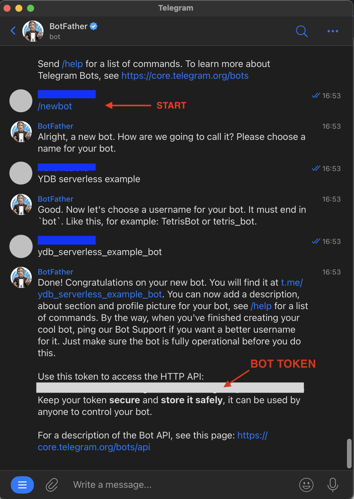
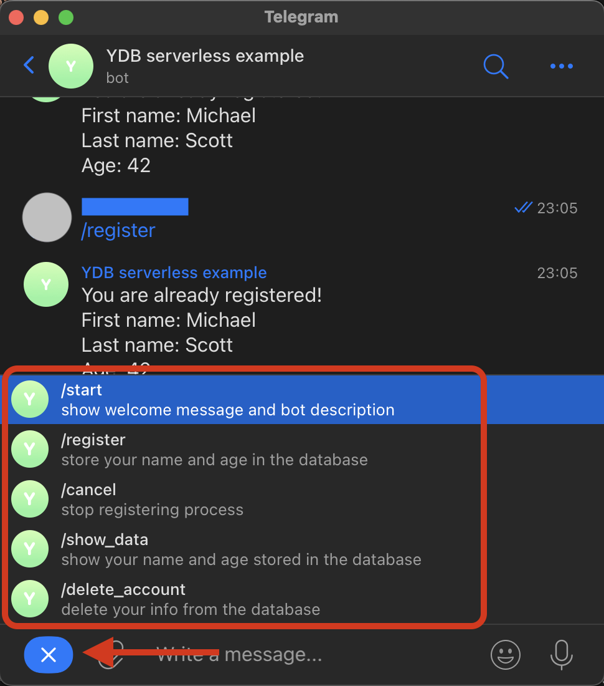

# Language Cards Bot

This is an implementation of Telegram bot for learning new foreign words.

This code is designed to be run on [Yandex Cloud Serverless Function](https://cloud.yandex.com/en/docs/functions/quickstart/?from=int-console-help-center-or-nav) connected to [YDB database](https://cloud.yandex.com/en/docs/ydb/quickstart?from=int-console-help-center-or-nav) using [TeleBot (pyTelegramBotAPI)](https://pytba.readthedocs.io/en/latest/index.html) python3 package.

## What does the bot do

The bot supports the following:

1. Adding multiple languages to study `/set_language`
2. Adding words and translations `/add_words`
3. Creating word groups within the language `/create_group`
4. Various training modes to help remembering the words `/train`:
    * `flashcards` - the translation is hidden under a spoiler to check yourself
    * `test` - 4 translations to choose an answer from
    * `a***z` - only first and last symbols of the words are shown, the learner has to write the whole word
    * `no hints` - the learner has to write the translation by themselves
5. Tracking the progress: no hints trainings produce scores for words `/show_words`
6. Choosing a specific subset of words to study
    * random words
    * newly added words - words with small number of trainings
    * words with low scores
    * words from a specific group
7. Deleting all user information from the database `/forget_me`

## How to set up an instance of the bot
### Creating Yandex Cloud function

1) Visit [Yandex Cloud page](https://cloud.yandex.com/) and click `Console` in upper right corner. Login into Yandex ID, or create an account.
2) In Yandex Cloud console set up Yandex Cloud billing account, if you don't have one. **No payments will be needed to complete this instruction.**
3) In Yandex Console create a folder for your resources. Choose any name. <details><summary>Screenshot</summary>
</details>
4) Create a service account with any name and assign it the `editor` and the `serverless.functions.invoker` roles for your folder. <details><summary>Screenshot</summary>
</details>
5) Create an API gateway with any name and the default specification. <details><summary>Screenshot</summary>
</details>
6) Create a Serverless Function with Python3.11 environment. Choose any name. In the Editor tab create a first default version, in the Overview tab make it public. <details><summary>Screenshots</summary>Create a function
 Select the environment  Create a default version  Make the function public </details>
7) Copy your function ID and save for the next step. <details><summary>Screenshot</summary>
</details>
8) Create a link between the API gateway and the Function - edit the API gateway specification and add the following code in the end, replacing `<function ID>` with value copied during the last step. Pay attention to the indentation - it should be exactly as in this snippet:
```
  /fshtb-function:
    post:
      x-yc-apigateway-integration:
        type: cloud_functions
        function_id: <function ID>
      operationId: fshtb-function
```

### Creating a bot and linking it with the function
1) Create a telegram bot by sending `/newbot` command for BotFather in Telegram. Give it a name and a login, then receive a token for your bot. <details><summary>Screenshot</summary>
</details>
2) (optional) Set up bot commands to create a menu. Send `/setcommands` to `BotFather`, choose your bot from the list and sent the following list of commands. This list will appear when clicking on the button in the bottom left corner of the bot chat. <details><summary>Commands</summary><pre>
  start - show welcome message and bot description
  register - store your name and age in the database
  cancel - stop registering process
  show_data - show your name and age stored in the database
  delete_account - delete your info from the database
  </pre>
</details>

3) Create a link between the telegram bot and the function. Run the following request from terminal, replacing `<YOUR BOT TOKEN>` with the token from BotFather and `<API gateway domain>` with `Default domain` value from Overview tab of your API gateway. All went well if you received response `{"ok":true,"result":true,"description":"Webhook was set"}`.
- <details><summary>Request</summary>

  ```
  curl \
    --request POST \
    --url https://api.telegram.org/bot<YOUR BOT TOKEN>/setWebhook \
    --header 'content-type: application/json' \
    --data '{"url": "<API gateway domain>/fshtb-function"}'
  ```

</details>

- <details><summary>Request for Windows</summary>

  ```
  curl --request POST --url https://api.telegram.org/bot<YOUR BOT TOKEN>/setWebhook --header "content-type:application/json" --data "{\"url\": \"<API gateway domain>/fshtb-function\"}"
  ```

</details>
</br>

At this stage sending `/start` to your bot should lead to successful POST requests from API gateway and successful Function invocations, which you can track on their respective Logs tabs.
<details><summary>Successful API gateway logs</summary>


</details>
<details><summary>Successful function logs</summary>


</details>
</br>
Note: the function does not do anything yet, except for waking up and going back to sleep.
</br></br>

### Creating a YDB database
1) Create a new serverless YDB database resource with any name in your folder. <details><summary>Screenshots</summary>Create YDB database resource  Give it any name 
</details>

2) Go to Navigation tab of the new YDB database, click `New SQL query` and run the following request to create 2 necessary tables. <details><summary>Screenshot</summary>

</details>

- <details><summary>SQL script</summary>

  ```
    CREATE TABLE `group_contents`
    (
        `chat_id` Int64,
        `language` String,
        `group_id` String,
        `word` Utf8,
        PRIMARY KEY (`chat_id`, `language`, `group_id`, `word`)
    );

    COMMIT;

    CREATE TABLE `groups`
    (
        `chat_id` Int64,
        `language` String,
        `group_id` String,
        `group_name` String,
        `is_creator` Bool,
        PRIMARY KEY (`chat_id`, `language`, `group_id`)
    );

    COMMIT;

    CREATE TABLE `languages`
    (
        `chat_id` Int64,
        `language` String,
        PRIMARY KEY (`chat_id`, `language`)
    );

    COMMIT;

    CREATE TABLE `training_session_info`
    (
        `chat_id` Int64,
        `session_id` Uint64,
        `direction` String,
        `duration` Uint64,
        `hints` String,
        `language` String,
        `strategy` String,
        PRIMARY KEY (`chat_id`, `session_id`)
    );

    COMMIT;

    CREATE TABLE `training_sessions`
    (
        `chat_id` Int64,
        `session_id` Uint64,
        `word_idx` Uint64,
        `hint` Utf8,
        `mistake` Bool,
        `score` Uint64,
        `translation` Utf8,
        `word` Utf8,
        PRIMARY KEY (`chat_id`, `session_id`, `word_idx`)
    );

    COMMIT;

    CREATE TABLE `user_states`
    (
        `chat_id` Int64,
        `state` Utf8,
        PRIMARY KEY (`chat_id`)
    );

    COMMIT;

    CREATE TABLE `users`
    (
        `chat_id` Int64,
        `current_lang` String,
        `session_id` Uint64,
        `state` Utf8,
        PRIMARY KEY (`chat_id`)
    );

    COMMIT;

    CREATE TABLE `vocabularies`
    (
        `chat_id` Int64,
        `language` String,
        `word` Utf8,
        `added_timestamp` Uint64,
        `last_train_from` String,
        `last_train_to` String,
        `n_trains_from` Uint64,
        `n_trains_to` Uint64,
        `score_from` Uint64,
        `score_to` Uint64,
        `translation` Utf8,
        PRIMARY KEY (`chat_id`, `language`, `word`)
    );
  ```

</details>

</br>


### Make your bot do something
1) Download the code from this repository and in terminal go to the directory, which contains `index.py`. Create a ZIP archive with the directory contents `zip -r ../code.zip *`. The command will create an archive in the parent folder.
2) In Editor tab of function:
    - Choose the upload method `ZIP archive`.
    - Click `Attach file` and select the code archive.
    - Fill `Entrypoint` field with `index.handler`.
    - Select your service account.
    - Create 3 environment variables: `YDB_DATABASE`, `YDB_ENDPOINT`, `BOT_TOKEN`. <details><summary>How to choose their values</summary>
      - `YDB_DATABASE` is a value from YDB database Overview tab: `Connection > Database`.
      - `YDB_ENDPOINT` is a value from YDB database Overview tab: `Connection > Endpoint`.
      - `BOT_TOKEN` is the token you received from BotFather after creating the new bot.</details> <details><summary>How it should look like in GUI - screenshot.</summary>
      
      </details>
3) Click `Create version` and wait for it to be created.

</br>
<b>Awesome! Now try your bot!</b>
